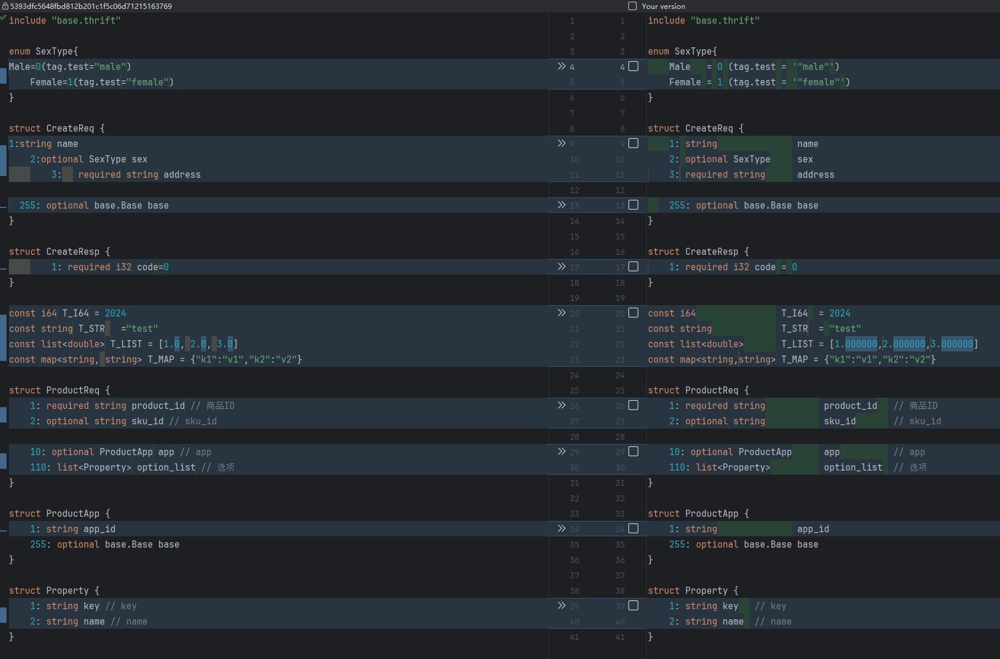
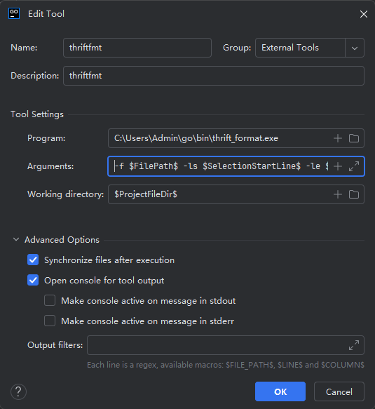
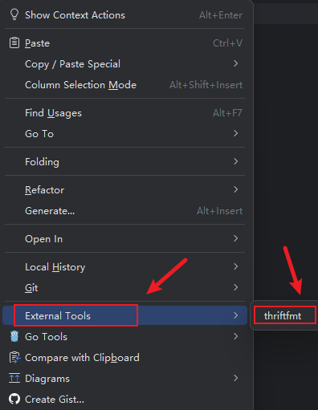

# thrift_format

# 介绍
用于格式化thrift文件的工具

# 效果


# 安装
```shell
go install github.com/liukunc9/thrift_format@latest
```

# 在IDEA中使用
### 1. File ->   Setting ->  Tools -> External Tools, 新建一个Tools，如下图



- Program: 上一步安装的路径
- Arguments: 参数
    - -f: 指定需要格式化的thrift文件路径(必要参数)
    - -ls: 格式化的起始行数(可选参数：不输入，则格式化整个文件)
    - -le: 格式化的结束行数(可选参数：不输入，则格式化整个文件)

- 图上Arguments参数：
```shell
-f $FilePath$ -ls $SelectionStartLine$ -le $SelectionEndLine$
```

### 2. 使用
> 只需要在 thrift 文件中，单击鼠标右键，选择配置的工具执行即可，如下图



# IDEA内置宏参数
- 常用
```shell
$FilePath$ # The absolute path to the current file.

$SelectionStartLine$ # The line number where the selection starts.

$SelectionEndLine$ # The line number where the selection ends.
```

[更多请参考官网](https://www.jetbrains.com/help/idea/built-in-macros.html)
